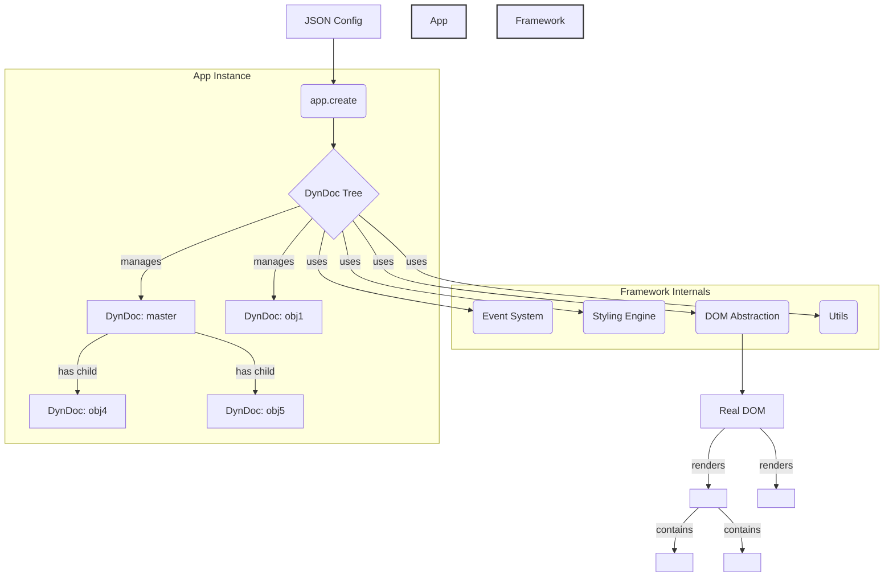

# The study more than ten years ago is now a pure commemoration and memory

# Year 2013
# BiGFramework / DynamicDocument 框架分析

好的，這是一個非常有趣的自製前端框架，從程式碼的註解和結構來看，我們可以深入了解它的設計理念和功能。

根據檔案開頭的註解 ([`framework.js:6`](framework.js:6))，這個框架被稱為 **BiGFramework**，其核心部分是 **DynamicDocument**（動態文件）。

這是一個用於 **透過 JSON 物件來宣告式地建立和管理複雜、可互動的階層式 DOM 結構** 的 JavaScript 框架。您可以把它想像成一個早期的、自製的、類似於 React 或 Vue 的元件化框架，但它有自己獨特的物件模型和渲染邏輯。

---

### 核心概念與詳細介紹

這個框架的主要目標是將 UI 的結構、樣式和行為抽象化，讓開發者可以透過操作 JavaScript 物件和 JSON 資料來控制畫面，而不是直接操作繁瑣的 DOM API。

以下是它的幾個核心組成部分：

#### 1. 核心建構函式 (Constructors)

*   **`App` ([`framework.js:995`](framework.js:995))**: 這是整個應用的主入口和管理器。每個應用都是一個 `App` 實例，它負責管理所有動態文件（`DynDoc`）、處理全域狀態、提供公用方法（如 `create`, `extend` 等）。
*   **`DynDoc` ([`framework.js:1038`](framework.js:1038))**: 這是框架的原子單位，代表一個「動態文件物件」。每一個 `DynDoc` 實例都對應到 DOM 中的一個元素（預設是自訂的 `<dyndoc>` 標籤）。它包含了自身的樣式 (`style`)、內容 (`content`)、子物件 (`children`) 和父物件 (`father`) 等屬性。

#### 2. 宣告式的 JSON 結構

框架最核心的特點是使用 JSON 來定義整個 UI 的結構。在檔案的末尾可以看到一個範例 `appobj` ([`framework.js:2937`](framework.js:2937))。

```javascript
var appobj = {
    DESCRIPTION: 'DynDoc',
    master: {
        father: 'body',
        style: { /* ... */ },
        content: 'Dynamic master',
        children: {
            obj4: { /* ... */ },
            obj5: { /* ... */ }
        }
    },
    obj1: { /* ... */ }
};

app.create(appobj); // 使用這個 JSON 來建立 DynDoc 樹
```

[`app.create()`](framework.js:1630) 方法會遞迴地解析這個 JSON 物件，為每一個 key（如 `master`, `obj4`, `obj1`）建立一個對應的 `DynDoc` 實例，並根據 `children` 屬性建立它們之間的父子階層關係。

#### 3. 豐富的工具函式集 (`UTILS`)

框架在 [`UTILS`](framework.js:41) 物件中封裝了大量實用的底層工具，以避免重複造輪子，例如：

*   [`isWhat()`](framework.js:49): 一個非常強大的型別檢查函式，可以精確判斷各種 JavaScript 物件型別。
*   [`defineProps()`](framework.js:110): `Object.defineProperties` 的進階封裝，用於精確控制物件屬性的行為（如 `get`, `set`, `enumerable` 等）。
*   [`cloneObj()`](framework.js:301) / [`mergeObj()`](framework.js:410): 用於深度複製和合併物件。
*   [`addEventEmitter()`](framework.js:476): 為任何物件添加事件發射器功能的核心方法。

#### 4. 強大的事件系統 (Event System)

框架內建了一套完整的事件發射/監聽機制 ([`framework.js:476`](framework.js:476), [`framework.js:2797`](framework.js:2797))。任何 `App` 或 `DynDoc` 物件都可以使用 `on()`, `emit()`, `off()` 等方法來進行通訊。這使得元件之間可以解耦合，透過事件來互動，而不是直接互相呼叫。

例如，一個元件可以發射一個事件：
`this.emit('myEvent', [arg1, arg2]);`

另一個元件可以監聽這個事件：
`anotherComponent.on('myEvent', function(arg1, arg2) { ... });`

#### 5. 樣式與佈局引擎

框架擁有一套自己的 CSS 解析和管理系統 ([`framework.js:2080`](framework.js:2080))。它不僅能設定絕對的 `width`, `height` 等值，還能處理相對定位。例如，子物件的 `top` 和 `left` 可以是相對於父物件的。它會自動計算出最終在頁面上的絕對座標。

所有樣式都儲存在 `DynDoc` 實例的 `_style` 私有屬性中，並透過 `_changeStyle` 方法同步到真實的 DOM 元素上。

#### 6. 模組化與擴充性

框架的設計非常注重擴充性。透過 [`app.extend()`](framework.js:1093) 方法，開發者可以為 `App` 和 `DynDoc` 的原型（`prototype`）、實例（`instance`）甚至私有屬性（`privateProps`）添加新的功能模組。整個框架後續的大部分功能，如日誌 (`log`)、DOM 處理、事件系統等，都是透過這個 `extend` 機制注入進來的。

#### 7. 環境偵測與跨平台能力

框架在啟動時會偵測自己是執行在 `browser`（瀏覽器）、`node.js` 還是 `worker`（Web Worker）環境中 ([`framework.js:2867`](framework.js:2867))。這表明作者在設計時就考慮到了讓這套邏輯不僅能在瀏覽器中渲染 UI，還有可能在伺服器或背景執行緒中運行（例如，在 Worker 中進行複雜的佈局計算，再將結果傳送給主執行緒去渲染 DOM）。

### 架構示意圖



### 總結

**BiGFramework/DynamicDocument** 是一個功能相對完備、設計思想先進的自製前端框架。它體現了現代前端框架的許多核心思想：

*   **宣告式 UI**：用資料（JSON）來描述 UI，而不是用程式碼去命令式地建構。
*   **元件化**：將 UI 拆分成獨立、可複用的 `DynDoc` 物件。
*   **狀態與畫面分離**：開發者操作的是 JavaScript 物件（`DynDoc` 實例），框架負責將物件的狀態同步到真實的 DOM 畫面。
*   **高擴充性**：提供了清晰的模組擴充機制。

儘管程式碼風格和 API 設計是 2013 年的樣式，但其背後的架構理念至今仍在主流框架中被廣泛使用。這是一個非常好的學習範例，展示了如何從頭開始建構一個前端框架。
